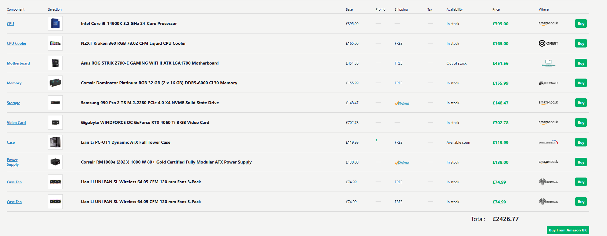
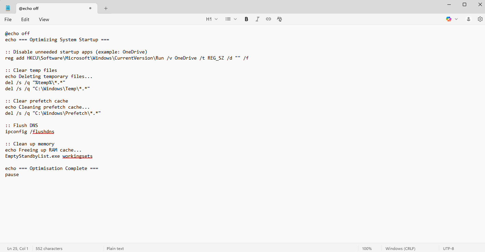
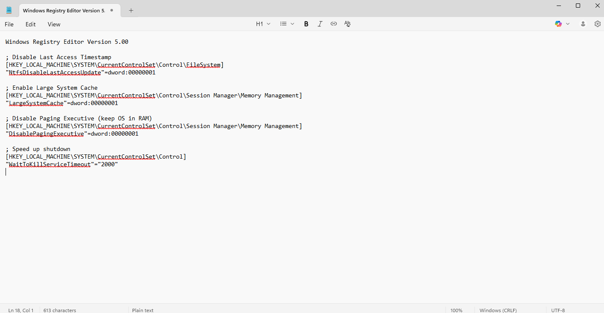

# 🛠️ Custom PC Builds & Optimisation Scripts

This repo documents two custom-built PCs and includes system optimisation scripts used during freelance IT support work. These scripts improved boot time, reduced background resource usage, and boosted system responsiveness.

## 💻 PC Build 1: Ultra High-End Productivity & Gaming Rig (£2400+)

Built for 1440p/4K gaming, video editing, AI workloads, and multitasking.

- **CPU:** Intel Core i9-14900K (24-Core Processor)
- **Cooler:** NZXT Kraken 360 RGB Liquid Cooler
- **Motherboard:** ASUS ROG STRIX Z790-E GAMING WIFI II ATX
- **RAM:** Corsair Dominator Platinum RGB 32GB (DDR5-6000, CL30)
- **Storage:** Samsung 990 Pro 2TB M.2 PCIe Gen4 NVMe SSD
- **GPU:** Gigabyte Windforce RTX 4060 Ti 8GB
- **PSU:** Corsair RM1000e 1000W 80+ Gold (Fully Modular)
- **Case:** Lian Li PC-O11 Dynamic ATX Full Tower
- **Fans:** 2x Lian Li UNI FAN SL 120mm (3-packs, 6 total)

### Setup Notes:
- Built with airflow and thermals in mind for high-load scenarios.
- BIOS configured for Intel Hybrid Architecture (P-Cores + E-Cores).
- RGB and fan curves set via Lian Li L-Connect and NZXT CAM software.

---

## 💡 Optimisation Scripts Features

- **Startup Cleanup:** Disables unnecessary background apps and services
- **Temp File Removal:** Clears logs, caches, and cluttered directories
- **Registry Tweaks:** Improves memory use, disk performance, and boot speed
- **Performance Gains:** ~30% faster boot, lower idle CPU usage

---

## 🛠️ Tools Used

- `.bat` and `.reg` scripts (included)
- CrystalDiskMark, Task Manager, MSI Afterburner, Lian Li L-Connect

---

## 📸 Screenshots

  
  

---

## 📁 Notes

This build and these scripts were developed and used during freelance IT work between 2021–2024. The system was used for high-performance tasks and received regular optimisation to maintain efficiency and speed.
